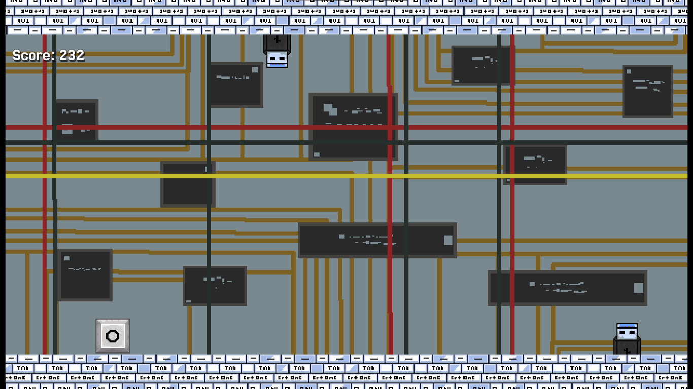

# One Key Shooting Gallery

OneKey runner is a dino runner like game but with the twist that gravity can flip while jumping. This is my second game in godot

## How to Play

Press SPACE to jump!

**Play on Itch.io :** https://bsastudio601.itch.io/onekey-runner

## Screenshot from the game

## Features

* pixel art 
* vibrant colors
* sprite animation
* cool game mechanics!
* Its playable in browser
* Made with Godot and libresprite
* active repository in github!

## How I Made It

I made the game using Godot and coded it with GDscript. It is my second time using godot and GDscript. Mainly i watched tutorials on youtube on how air now i feel confident ato make a jumping runner game and followed those. but i needed to fix bugs here and there with gpt honestly. though i asked him to explain why each chance is necessary.

# Well hope you like it :3
